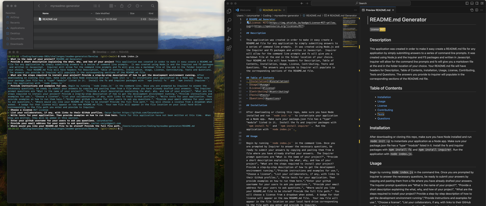

# README.md Generator

## Description

This application was created in order to make it easy create a README.md file for any application by simply submitting answers to a series of command line prompts.  It was created using Node.js and the Inquirer and FS packages and written in Javascript.  Inquirer will allow for the command line prompts and fs will give you a markdown file at the end in the folder location of your choice.  Your README.md file will have headers for Description, Table of Contents, Installation, Usage, License, Contributing, Tests and Questions.  The answers you provide to Inquirer will populate in the corresponding sections of the README.md file. 

### Video Demonstration
[Click here to watch the video demonstration](https://youtu.be/s93dcGQD4F4)

## Table of Contents
- [Installation](#installation)
- [Usage](#usage)
- [License](#license)
- [Contributing](#contributing)
- [Tests](#tests)
- [Questions](#questions)

## Installation

After downloading or cloning this repo, make sure you have Node installed and run ``node init -y`` to instantiate your application as a Node app.  Make sure your package.json file has a "type" "module" listed in it.  Install the fs and inquirer packages with ``npm install fs`` and ``npm install inquirer``.  Run the application with ``node index.js``.  

## Usage

Begin by running ``node index.js`` in the command line. Once you are prompted by Inquirer to answer the necessary questions, be ready to submit your answers by copying and pasting them from a file where you have already drafted your answers. 

 The Inquirer prompt questions are 
 1. "What is the name of your project?", 
 2. "Provide a short description explaining the what, why, and how of your project", 
 3. "What are the steps required to install your project? Provide a step-by-step description of how to get the development environment running.",
 4. "Provide instructions and examples for use.", 
 5. "Choose a license", 
 6. "List your collaborators, if any, with links to their GitHub profiles.", 
 7. "Write tests for your application. Then provide examples on how to run them here.",
 8. "Enter your github username for your users to ask you questions.", 
 9. "Provide your email address for your users to ask questions.", 
 10. "Where would you like your README.md file to be stored? Provide the full file path."  
 
 You will choose a license from a dropdown when asked.  A badge for that license will appear on the new README.md file.  
 
 Your new file will appear in the file location on your local hard drive corresponding to the file path you enter and provide to Inquirer.  

## License

Apache License 2.0

The license for this application is Apache License 2.0.

https://opensource.org/license/apache-2-0

## Contributing

Contributors: 

Caryn Carter https://github.com/Caryndcarter 

To contribute, contact carter.caryn@gmail.com.

## Tests

Tests for this application have not been written at this time.  When they are written, they will be added in this section.  

## Questions

For questions visit https://github.com/caryndcarter or write to carter.caryn@gmail.com.

/Users/caryncarter/Coding/myreadme-generator/README.md